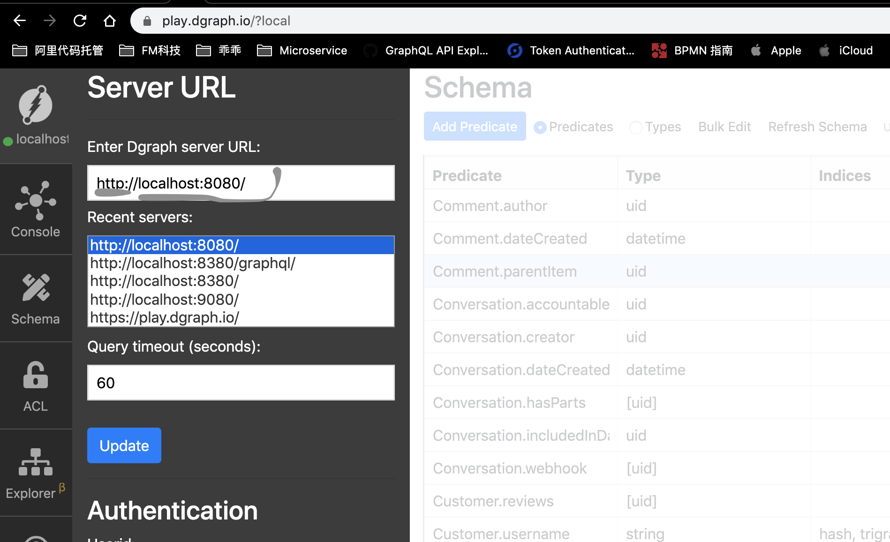
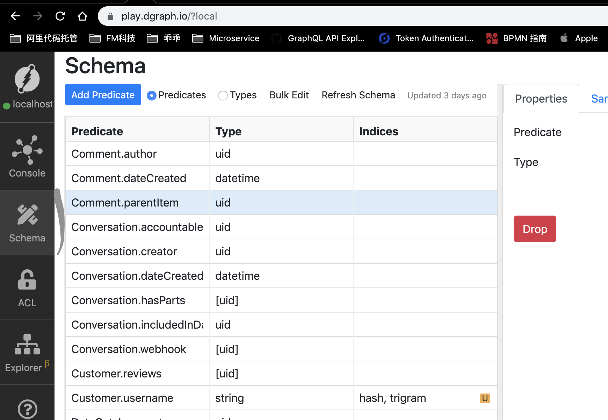
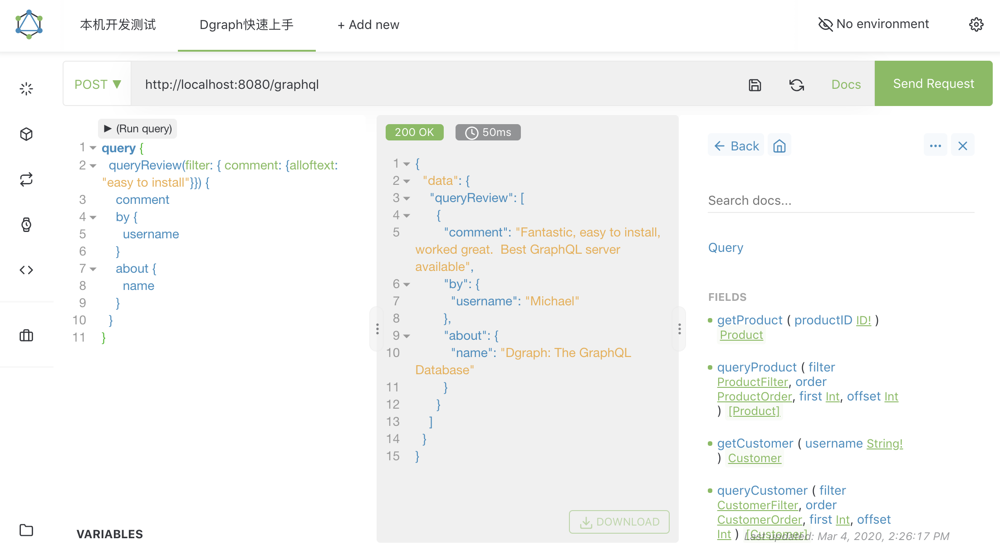
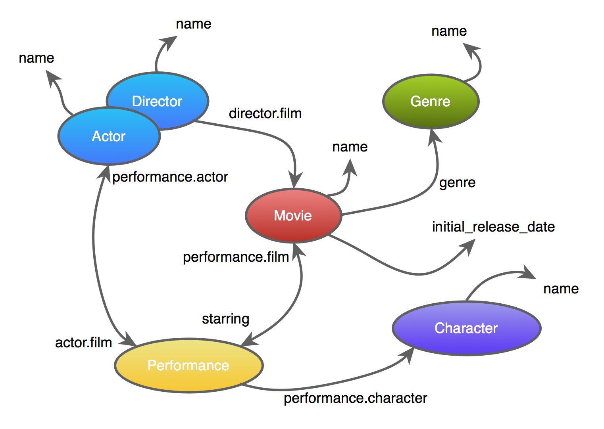

# kgis-datalake-dgraph
图谱信息系统数据湖基于dgraph database

# 快速开发参考
[https://graphql.dgraph.io/docs/quick-start/](https://graphql.dgraph.io/docs/quick-start/)

1. 提前创建好mount的目录: /mnt/dgraph
    ```
    $ sudo mkdir /mnt/dgraph
    ```
1. 启动All in One开发模式的dgraph服务
    ```
    docker run -p 8080:8080 -it -v /mnt/dgraph:/dgraph dgraph/standalone:v2.0.0-rc1
    docker run --rm -it -p 8000:8000 -p 8080:8080 -p 9080:9080 dgraph/standalone:latest
    ```
1. 把上述schema创建到Dgraph服务上
    ```    
    $ ../gradlew schemamerge 
   
    $ curl -X POST localhost:8080/admin/schema -d '@build/schema-merged.graphql'

    ```
1. [Ratel查看生成的dgraph schema](https://play.dgraph.io)
    
    
1. 在Chrome右上角打开Altair,在Altair请求地址: http://localhost:8080/graphql .
        
1. 按照[https://graphql.dgraph.io/docs/quick-start/](https://graphql.dgraph.io/docs/quick-start/)练习吧

************************************************************************
************************************************************************
************************************************************************

# kgis-datalake-dgraph

 知图初源数据湖 Knowledge Graph Initial Source - Data Lake

1. [Run Dgraph](https://tour.dgraph.io/intro/2/)

# Run Dgraph

Let’s run an instance of Dgraph on your machine; that’ll give you a handle on installing Dgraph and loading data yourself.

All the data in this tutorial will be stored in the instance you install and all the queries will look for Dgraph on your local machine. By running it in a container, you’ll have a fresh Dgraph that will serve as a sandbox for you to learn and experiment with.

There are a number of ways to install and run Dgraph. For this tutorial, let’s run it in a container with Docker.

First, grab the latest version of Docker.

Then, pull the latest Dgraph version with:

```
docker pull dgraph/dgraph
```

Now, to run Dgraph in Docker, it’s:

```shell
mkdir -p ~/dgraph
```

```shell
# Run dgraphzero
docker run -it -p 5080:5080 -p 6080:6080 -p 8080:8080 -p 9080:9080 -p 8000:8000 -v ~/dgraph:/dgraph --name dgraph dgraph/dgraph dgraph zero

# In another terminal, now run dgraph
docker exec -it dgraph dgraph alpha --lru_mb 2048 --zero localhost:5080

# And in another, run ratel (Dgraph UI)
docker exec -it dgraph dgraph-ratel
```
That’s it!

Dgraph Alpha will now be running and listening for HTTP requests on port 8080 and Ratel would be listening on port 8000. There are more options, but that’s all we need to get started.

# Now tutorial
1. https://tour.dgraph.io/intro/3/
1. http://localhost:1313/  
    - install https://github.com/dgraph-io/tutorial
    ```
    ConandeMacBook-Pro:dgtutorial conanchen$ ls ./scripts/local.sh
    ./scripts/local.sh
    ConandeMacBook-Pro:dgtutorial conanchen$  ./scripts/local.sh
    ```


# Real Example 
1. [IEntityService define interfaces to manipulate data](https://github.com/intuit/katlas/blob/c0529ed75d7f121eca08e92791043ff132b6019b/service/apis/entity_service.go)
1. Dgraph is at version 1.1.x and is production ready. Apart from the vast open source community, it is being used in production at multiple Fortune 500 companies, and by [Intuit Katlas](https://github.com/intuit/katlas) and [VMware Purser](https://github.com/vmware/purser).
1. [](https://blog.dgraph.io/post/client0.8.0/)


# 使用生成的kgis graphql client sdk开发
1. 在目录dgraphschemadesign设计编写到kgis-dgschema.graphql，按照[dgraph的graphql支持模块](https://dgraph.io/graphql)设计
1. 按照上面【快速开发参考】把【io.github.kgis-dgschema.graphql】更新schema到dgraph数据库中
1. 使用改造过的[shopify graphql client code gen](https://github.com/covid19angels/graphql-java-client-codegen-gradle-plugin)生成的kgis query/mutation等辅助java类，编写业务处理逻辑
1. 更新git子模块
    ```
    $ git submodule update --recursive --init --remote
    ```